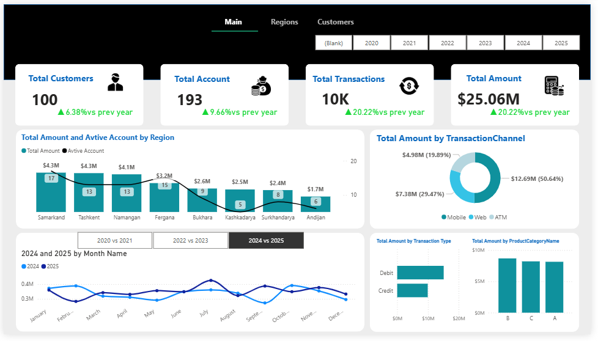
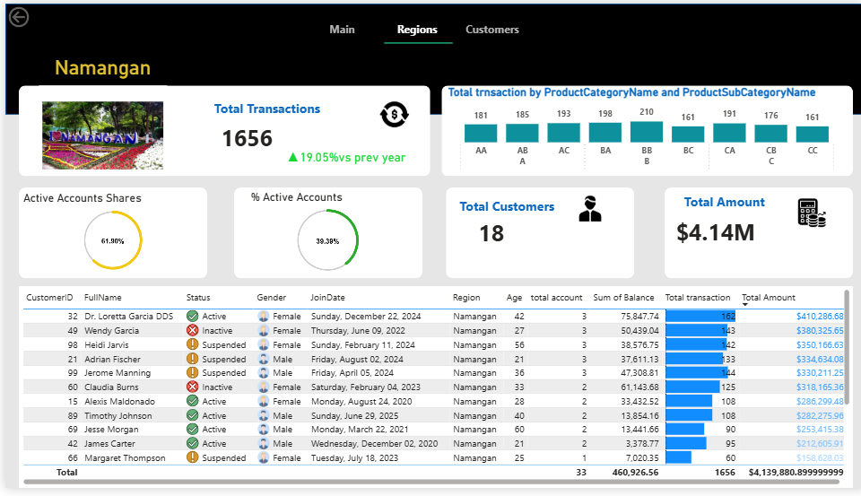
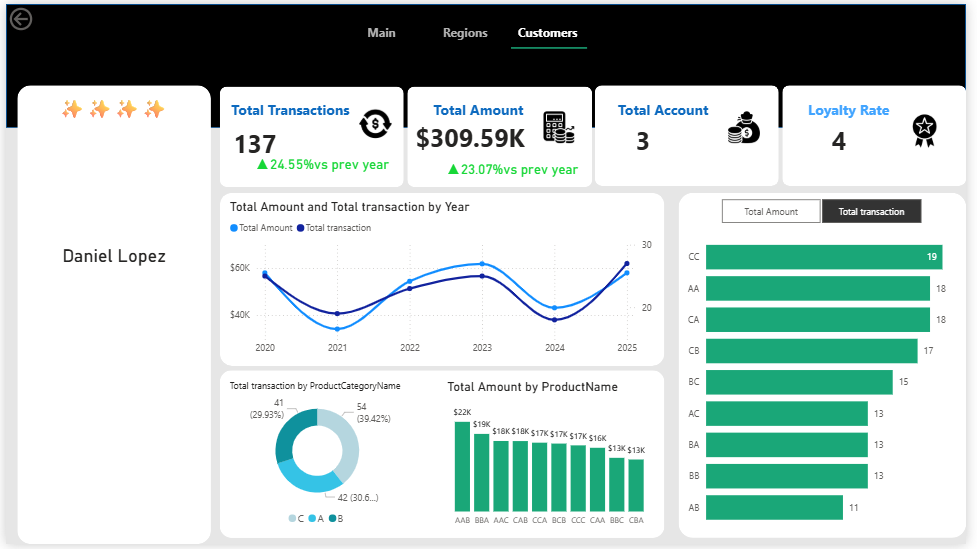

# 📊 Power BI Sales Dashboard Demo

This repository contains a demo **Power BI dashboard project** used for data analysis and visualization.

The project demonstrates how to analyze business data using **Power BI**, **SQL**, and **data modeling techniques**.

---

# 🚀 Project Overview

This dashboard provides insights into:

* Sales performance
* Regional distribution
* Customer analysis

The report contains the following pages:

### 1️⃣ Main Dashboard

Overview of key metrics and general performance indicators.

### 2️⃣ Regions Analysis

Breakdown of sales and performance by regions.

### 3️⃣ Customer Insights

Customer distribution and activity analysis.

---

# 🛠 Tools & Technologies

* Power BI
* PostgreSQL
* SQL
* Python
* Microsoft SQL Server (SSMS)

---

# 📊 Dashboard Preview

### Main Dashboard



### Regions Dashboard



### Customers Dashboard



---

# 📂 Project Structure

```
powerbi-sales-dashboard-demo
│
├── data
│
├── dashboard
│   └── dars.pbix
│
├── screenshots
│
└── README.md
```

⭐ If you like this project, feel free to star the repository.
